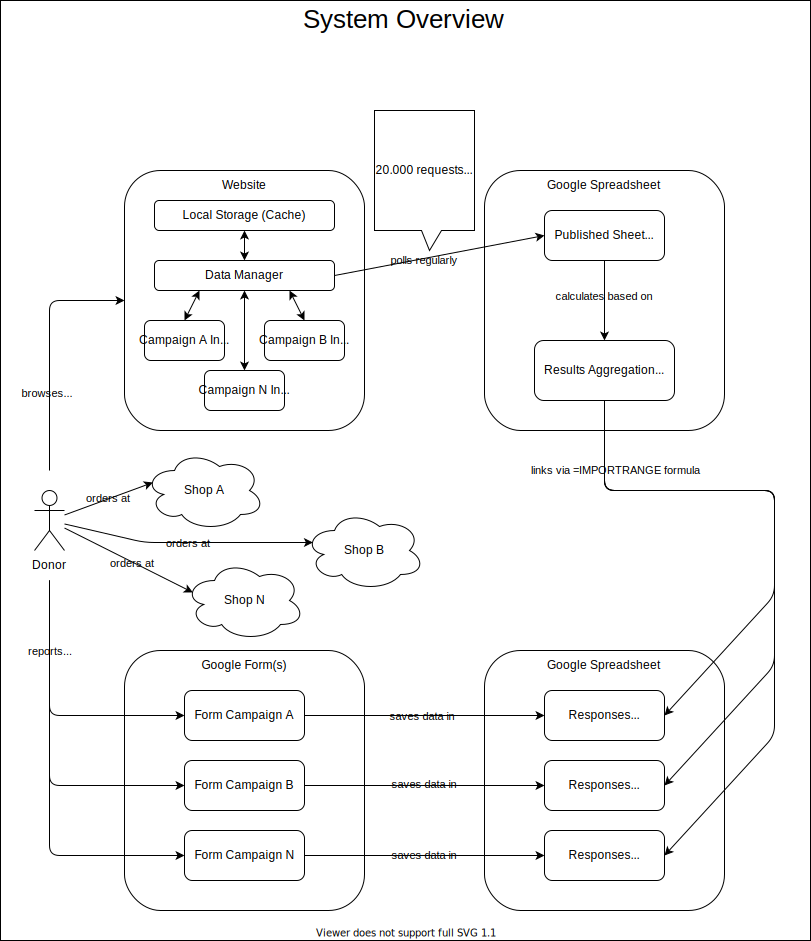

# Project Documentation

This section helps you to set everything up if you want to reuse this

## Notes from Discovery

- Google Spreadsheets need a bit to update
  - within up to 5 minutes you may get different results from the published spreadsheet
  - have a =NOW() formula in there to find teh latest version; cache locally in local storage to avoid hitting quotas to fast
  - the limit of the CSV Fetch is: URL Fetch calls 20,000 / day (see https://developers.google.com/apps-script/guides/services/quotas)
- Survey Monkey limits you to 500 API requests per day and 120 per minute; https://www.surveymonkey.de/r/2PK6JLP
  - you have no "API" to pull teh results outside of the Survey Monkey results page (at least not if you use the free version)

## Overview

