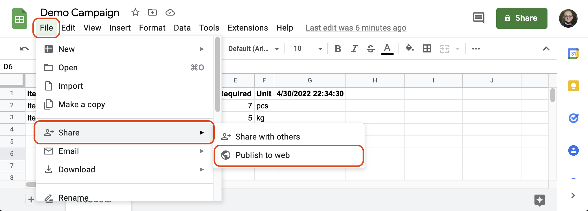
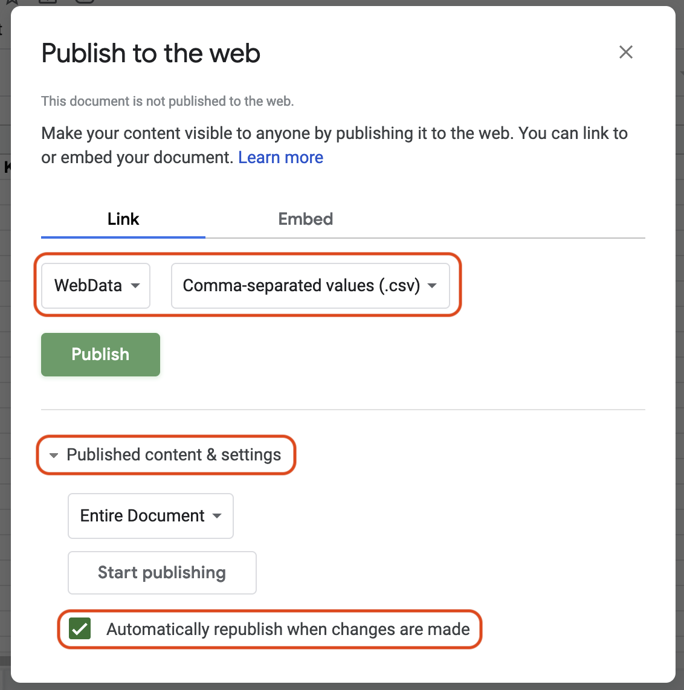
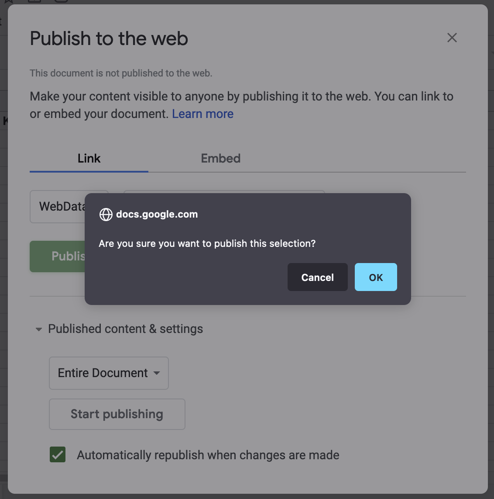
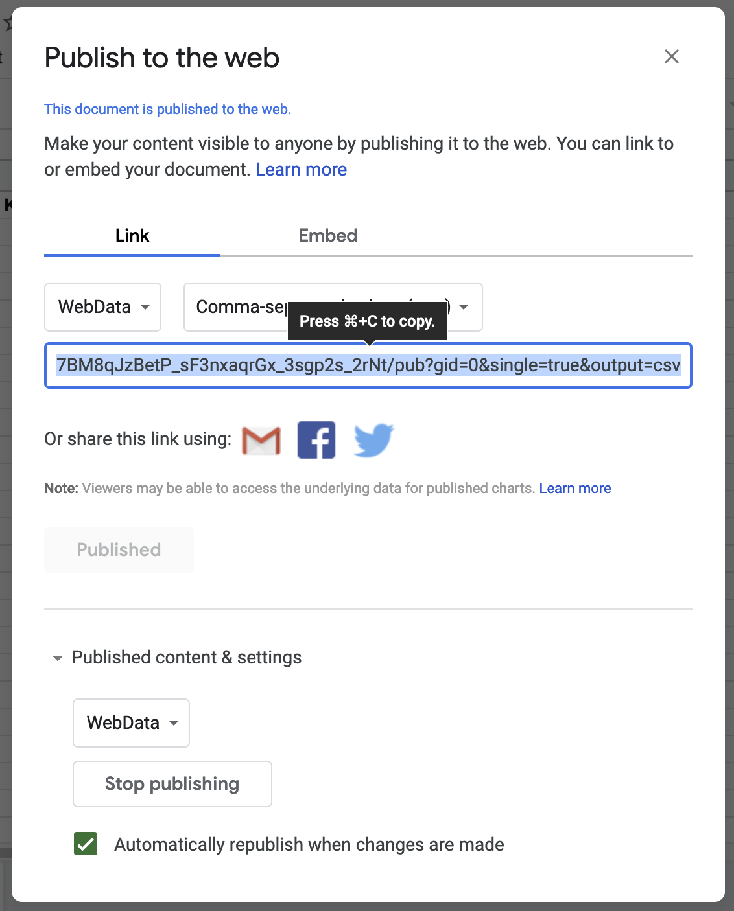
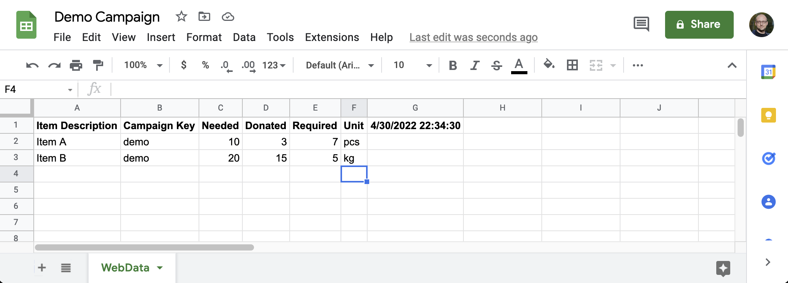

# Setup (and operation)

This document contains all you need to know to run a simple donation campaign using this tool.

***Don't be scared about it's length.** We tried to cover everything very detailed (so that you do not need to ask anyone if you have no deep knowledge in one part or the other) - and if you already have some knowledge you should be able to do this quite fast... ;)*

- [Setup (and operation)](#setup-and-operation)
  - [Prerequisites](#prerequisites)
    - [Required Knowledge](#required-knowledge)
    - [Build Computer](#build-computer)
    - [Webspace](#webspace)
    - [Google Drive, Spreadsheets and Forms](#google-drive-spreadsheets-and-forms)
  - [Google Setup](#google-setup)
    - [Donation Data Source - the first spreadsheet](#donation-data-source---the-first-spreadsheet)
    - [Donation Registration Form - the first form](#donation-registration-form---the-first-form)
    - [Connecting the form responses with the Donation Data Source](#connecting-the-form-responses-with-the-donation-data-source)
  - [Website Setup](#website-setup)
    - [Download and configure the website](#download-and-configure-the-website)
    - [Build and test the website](#build-and-test-the-website)
    - [Upload the website to a server](#upload-the-website-to-a-server)
    - [Update the website](#update-the-website)
    - [Add another campaign](#add-another-campaign)

## Prerequisites

There are a few things that are needed before you can start:

### Required Knowledge

You know how to

- create and manage Google Forms
- create and work with Google Spreadsheets (including formulas)

It is a huge advantage if you know a bit (more) about

- React (GatsbyJS is based on that)
- Frontend development with a `node` & `npm` based toolchain
- using a code editor / IDE like VS Code
- using git as version control system

We will try to explain all things as detailed as possible, but having knowledge beyond this setup guide will help you to truly make this part of your own campaign.

### Build Computer

The toolchain that is used is available for all three major platforms (Linux, MacOS and Windows).

- we recommend having 8 or more GB of RAM
- [nodeJS](https://nodejs.org/en/) -> at the time of writing we recommend version 16; with version 18 you may still have some trouble
- the [GatsbyJS](https://www.gatsbyjs.com/docs/) CLI -> you can get it by running `npm install -g gatsby-cli`
- at least 2 GB free Hard drive space (after the installation of the above); better double or more

### Webspace

The website part needs to be hosted somewhere - we tried our best to have as minimal requirements as possible

- about 5 to 10 MB for the basic page
  - more space according to the number of photos you want to put online with your campaigns
- no server side scripting required - serving static HTML pages is enough
  - it can be an advantage (more smooth operation) if you can use a rewrite module

### Google Drive, Spreadsheets and Forms

- you need to have a Google Drive enabled account
- you need to create at least one Spreadsheet (for more privacy maybe even more)
- you need to have the rights to publish the Spreadsheet
- you need to create at least one Google Form (maybe more, depends how many campaigns you want to run)
- you may want to add collaborators, so you need to be entitled to do so

As long as you have some space left in your Google Drive Account there should be no issues...

## Google Setup

### Donation Data Source - the first spreadsheet

1. create a new folder in [Google Drive](https://drive.google.com/)
1. open that Folder
1. create a new Spreadsheet (blank one, no template needed)
1. make sure you give it a name that you can remember (e.g. `My Campaign Data`)
1. name the already existing Spreadsheet something like `WebData`
1. now go to `File` > `Share` > `Publish to web` 
1. in the dialog make sure that you have
   - selected the sheet (and not the entire document)
   - selected `Comma-separated values (.csv)`
   - checked `Automatically republish when changes are made` in the `Publish content & settings` section 
1. press `Publish` and confirm the upcoming confirmation dialog with `OK` 
1. After a few seconds you should see the generated link where the document now published and available 
1. copy that link and note it down somewhere. And no worries, you can access it again in the dialog at any time. Then you can close the dialog.
1. finally fill the sheet so that it matches the next screenshot:

Note that the last item in the first row is a `=now()` formula! Once entered the spreadsheet should show date and time as the cell's value. To achieve that you may have to edit the cell on it's own and then leave it by pressing enter / return.  
The same is true for the column E; the cell content of row 2 and 3 is a simple formula to calculate how much is still required.

Below you can copy all the values so that you can avoid typos:

|Item Description|Campaign Key|Needed|Donated|Required|Unit|=now()|
|-|-|-|-|-|-|-|
|Item A|demo|10|3|=C2-D2|pcs| |
|Item B|demo|20|15|=C3-D3|kg| |

**Congratulations, you have created the data source for the website!**

*Note that the row 1 needs to have the exact data as shown above - from row 2 onwards you can put the data of the items that your campaign actually needs. There is also no limit of items, so feel free to add more lines as you need.*

### Donation Registration Form - the first form

... to be written ...

### Connecting the form responses with the Donation Data Source

... to be written ...

## Website Setup

### Download and configure the website

... to be written ...

### Build and test the website

... to be written ...

### Upload the website to a server

... to be written ...

### Update the website

... to be written ...

### Add another campaign

... to be written ...
